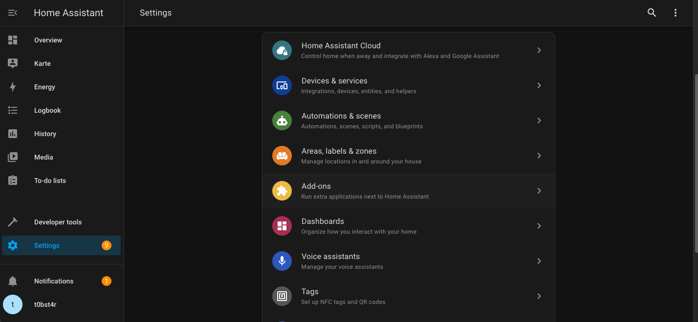
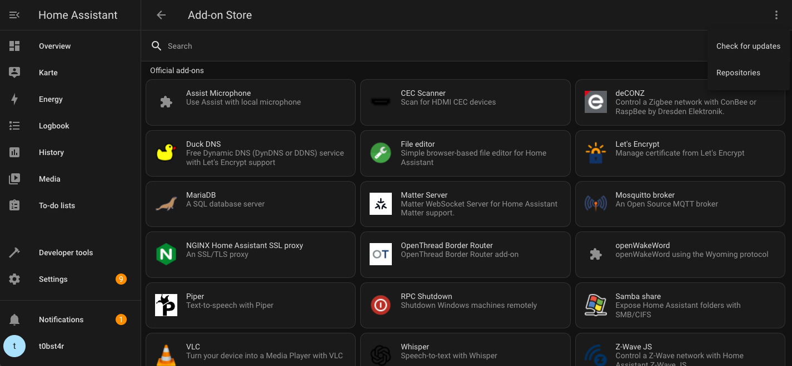
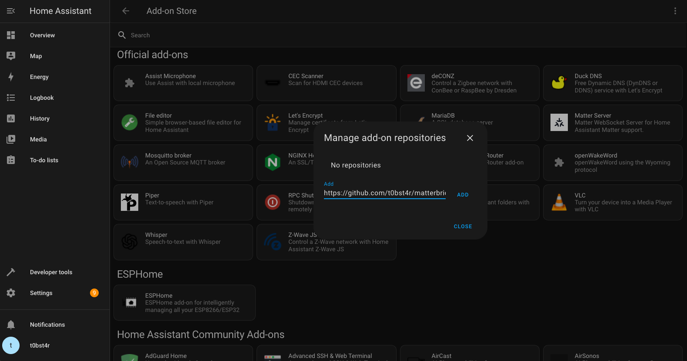
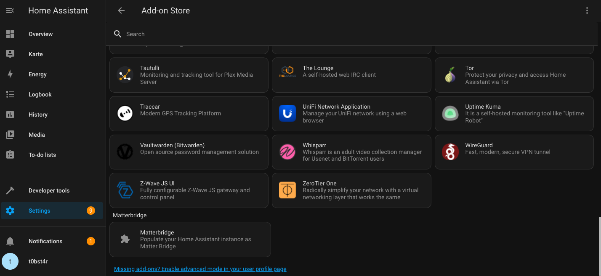
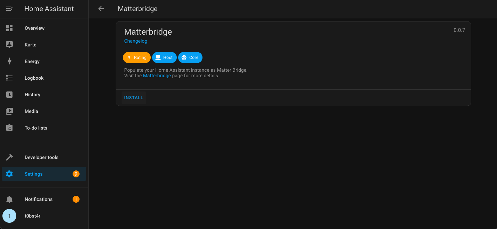
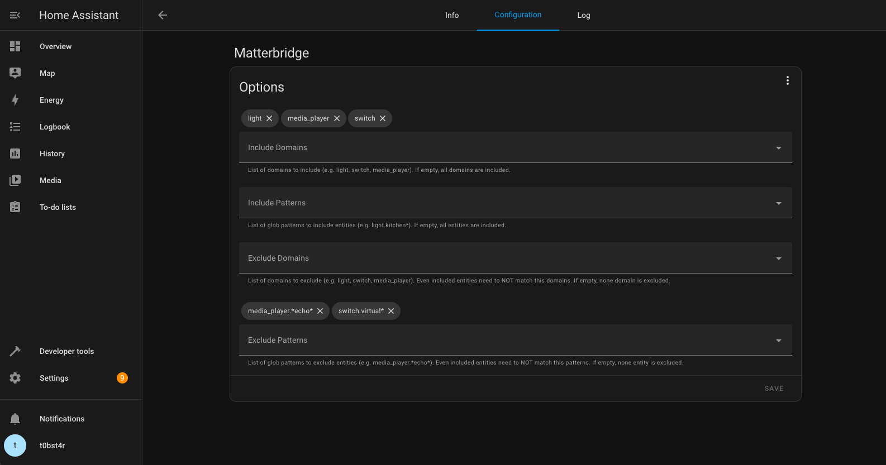
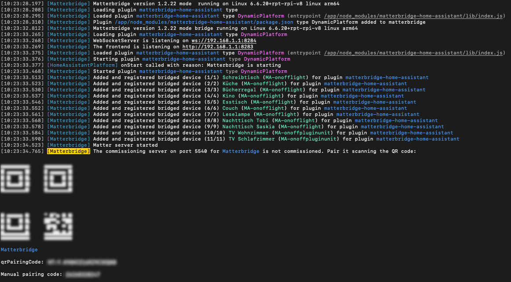

# Matterbridge Home Assistant Addon

This Home Assistant Add-On populates entities of the home assistant instance as a Matter-bridge.

# Installation

Open Home Assistant and navigate to the addon settings.

Open up the Add-On store and open the "Repositories" menu in the top-right corner.

Enter the URL of the GitHub Repo to the list of your add-on repositories (`https://github.com/t0bst4r/matterbridge-home-assistant-addon`).

After the repository is added, refresh your Add-On Store page and find the Add-On in your list of Add-Ons.

Open the Add-On page and click "install".

**Before starting the plugin** open the configuration tab and enter your configuration.

Start the addon and find the commissioning QR code in the Add-On logs or the web ui.
This code can be used to connect your Matter clients (like Alexa, Apple Home or Google Home) to the bridge.

# Contributors

[//]: # (x-release-please-start-version)

[//]: # (x-release-please-end)

---

